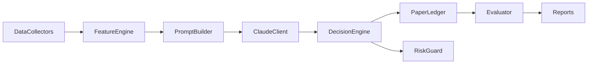

# System Design

## Architecture

## Data Contracts

- Market snapshot: prices, spread, liquidity, and metadata.
- Feature set: implied probability, estimated probability, edge bps, EV per $1.
- Claude decision schema: strict machine-parseable JSON.

## Failure Modes

- Missing API key: falls back to deterministic heuristic decision.
- Invalid LLM JSON: fallback decision and continue.
- Risk gate violation: force `SKIP`.

## Guardrails

- `paper_mode=true` by default.
- configurable liquidity/spread/edge/confidence thresholds.
- append-only ledger for auditability.
